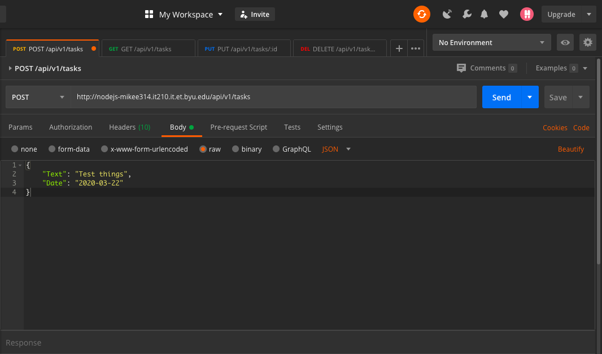
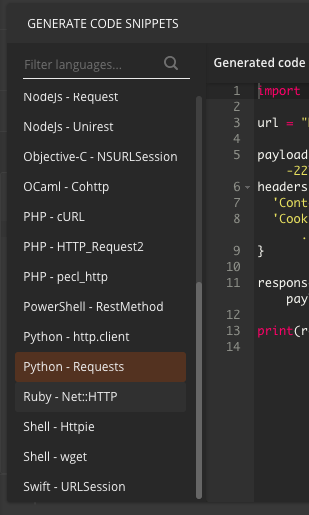

# Lab 5A—Python and Unit Testing

## Overview

We'll soon be building a web API (**A**pplication **U**ser **I**nterface) for our task list. As we build it, and if we need to make changes to it, it will be important to know when it is working properly. Humans are prone to errors, so only thorough rote tests or a great deal of luck would ensure that our API will work the way we need it to.

Enter Unit Testing.

### Functionality

- Python script which tests all endpoints of an API

### Concepts

- Python
    - Scripts
    - Shebang
- Unit Testing
    - Test cases
    - Test-driven development

### Resources

- [Python official website](https://www.python.org/)
- [Python official documentation](https://docs.python.org/3/)
- [Unit testing in Python](https://docs.python.org/3/library/unittest.html)
- [w3schools intro to Python](https://www.w3schools.com/python/python_intro.asp)
- [Requests](https://requests.readthedocs.io/en/master/)
- [Python `pass` statements](https://www.programiz.com/python-programming/pass-statement)
- [Python Top-level script environment](https://docs.python.org/3/library/__main__.html)

## Instructions

Unit testing, when done right, gives an excellent benchmark as to how close you are to a finished product. Each test that fails tells you exactly what needs to be fixed, and each test that passes gives a terrific sense of accomplishment and is a tangible step toward the end. As you build and modify your API, you will know exactly when you break something, as you inevitably will.

For now, we will scaffold many unit tests, and write them such that they pass when testing our fully-functional APIs, and fail at the right times on our faulty APIs. Both kinds will be provided for you.

#### Why Python?

Python is a scripting language which has become popular over the years, and for good reason. It's capable of being run on almost every OS, it's [beautiful](https://www.python.org/dev/peps/pep-0020/), and it's [easy](https://xkcd.com/353/). Also, we're into
teaching you diverse technologies, and it's [popular](http://pypl.github.io/PYPL.html).

### Step 0: Install

#### Python

Download and install Python from the [Python Downloads](https://www.python.org/downloads/) page.
Make *absolutely sure* you have at least Python 3; Python 2 is no longer supported. We would suggest at least Python 3.6, and
the more recent you can get, the better. As of right now writing this lab, Python 3.8.2 is the current version, and is recommended.
We will assume you have this version for the remainder of the instructions. The Windows installer is the one labelled
__Windows x86-64 executable installer__. Make sure to check the box during installation to __Add Python 3 to PATH__.

#### Requests

You should now be able to find an executable in your path called `pip3.8`. To install requests, run this command:
```
pip3.8 install Requests
```
Pay attention to the output of this command, and if it errors, look those up and *fix them!* Get Requests installed!

#### Test Python
    
You should now be able to find an executable on your system for `python3.8`. Open it up. In the top left of the window, you
should see `Python 3.8.2` (or some version close to that), and a couple of lines down, you should see the `>>> ` prompt. Type this in, note the capitalization:
```Python
import requests
```
If Python complains that there is `No module named 'requests'`, go back and make sure you installed Requests correctly. If it
doesn't say anything, and just dislpays the prompt `>>> ` again, Requests is properly installed, and you can quit the prompt by typing `exit()`.

> Note: On some Windows systems, you might need to use the command `py`, instead of `python` or `python3.8`. Just make sure the version matches the one you downloaded.
    
#### Visual Studio Code Extension for Python

There are many ways to do this.

#### Postman

[Postman](https://www.getpostman.com/products) is a great, free tool that helps with developing APIs. Due to the nature of an API not having a UI, it's difficult to test your endpoints. You can use a web browser for `GET` requests, but not for `POST`, `PUT`, or `DELETE` requests. We will be using this in later labs more intimately, but for now, it will help us write some of our code. It's optional for now, but it might be a good idea to get familiar with it in preparation for future labs.

### Step 1: Write the Methods

1. In the file called `api.py`, do the following:

    > Note: This file is [provided for you](../api.py). Follow along with it and make sure everything is added properly.

    1. Add a shebang (see [this SO question](
    https://stackoverflow.com/questions/6908143/should-i-put-shebang-in-python-scripts-and-what-form-should-it-take))

    1. Import Requests. This will appear just how we did it before, but this time inside the file, not in the prompt.

    1. Import `urljoin` from `urllib.parse`:
        ```Python
        from urllib.parse import urljoin
        ```
    1. Know the endpoints you are testing: 
    
        | HTTP Method | Endpoint                 | Expected Response   | Headers             | Body      |
        |-------------|--------------------------|---------------------|---------------------|-----------|
        | GET         | `api/v1/auth/google`     | Google Login page   | none                | none      |
        | POST        | `api/v1/tasks`           | New created task    | Content-Type, Cookie | Text, Date |
        | GET         | `api/v1/tasks`           | List of tasks       | Cookie              | none      |
        | GET         | `api/v1/tasks/[task_id]` | Single task         | Cookie              | none      |
        | PUT         | `api/v1/tasks/[task_id]` | Updated task        | Content-Type, Cookie | Done      |
        | DELETE      | `api/v1/tasks/[task_id]` | Confirm delete task | Cookie              | none      |
        | GET         | `api/v1/user`            | Logged in user info | Cookie              | none      |
    1.  A class called `API` has been made for you with the following methods: `__init__`, `create_task`, `read_task`, `read_all_tasks`,
    `update_task`, `delete_task`, `read_current_user`.

        > Note that except for the case of `__init__`, you may rename these methods as you deem appropriate. I chose to name them after their responsibilities, but if you prefer to name them after their http methods, i.e. rename `update_task` to `put`, please do so, but be consistent. The same goes for all user-defined variables and functions. Python keywords, third-party module names, and the `unittest` methods, however, have specific spelling rules which you must follow to the letter.

        > Note: __All__ methods __must__ have `self` as the first argument.

    1. Below the class definition, a name guard has been created for you. See [this SO question](
    https://stackoverflow.com/questions/419163/what-does-if-name-main-do)) to learn more about name guards.  

1. Get Coding

    > You may use Postman to help you write the methods. For example, write out your request in Postman, then select `code` from the right side of the screen, and in the menu that appears on the left side, choose `Python - Requests`.
    
    

    1. Define parameters to each method, including a `base_url`, `cookie`, and any other necessary data.

    1. Take out the `pass` statement

    1. Define any headers you need, and any data payloads you need

    1. Make a request, and store it in a response variable

    1. Return the response variable

1. Inside each name guard, call the methods in that file to test them, with some example data.

1. Test out each method. Explore the contents of each response when you provide good data as well as bad data, to get a feel for
the expected responses. For simplicity, use `http` instead of `https`.

    > Note: The cookie you pass in must be an actual cookie, verified on an API through the browser, at the `/api/v1/auth/google` endpoint. Otherwise, you will (or should) get a 401 every time. This method is called session hijacking, because the unit tests don't ever verify with the endpoint. The cookie is the only thing our APIs check to see if the user is actually verified, which is why this works. You can get a valid cookie by authenticating at that endpoint. Once you've logged in, you should be able to find a cookie called `it210_session`. Copy its value (a long string of random characters) and paste it in your code in the necessary places.

### Step 2: Document your methods

As discussed in class, Python documentation takes the form of a comment right after the definition of a function or method.

```Python
def avgThree(x, y, z):
    """Return the average of three numbers"""
    return (x + y + z) / 3
```

Document all your methods this way with the following:

1. A short, one-line imperative description of the method (i.e. `return the sum of x and y` not `returns the sum of x and y`)

1. A longer description, if needed

1. A list of arguments, with a short description of each

1. A description of the return value

Armed with these descriptions, Visual Studio Code can now help you when you use these later. It will display arguments with the
docstring you have written, and can be very useful, especially when another person comes along who hasn't written your methods,
so they can use them properly.

### Step 3: Write the Unit Tests

> Some of these steps may be done for you in the [file we included](../test_api.py). Follow along with this file, and fill in what's missing.

1. Make a file called `test_api.py`.

1. In this file, import the `API` class from the other file you wrote in step 1.

1. The class TestAPI has been made for you and inherits from `unittest.TestCase`.

1. Write these twelve tests, such that they properly test the APIs. Each test should be a method of the Test Class which has a name that begins with `test`.

    > The hallmark of a unit test case is the use of an `assert...` method. There are [twelve methods total](https://docs.python.org/3/library/unittest.html#assert-methods). You do not need to use all of them; focus on the first four, and branch out as need arises.

    1. Proper tasks that "work"
        * Create—The response has the `Text` and `Date` which you gave; the `Done` is `False`; status is 201; Check that task has UserId property 
        * Read One—After creating; the response has the `Text` and `Date` which you gave; the `Done` is `False`; Check that task has UserId property 
        * Read All—After creating; all tasks have the same user ID
        * Update—After creating; the response has the expected `Done` value
        * Delete—After creating; the response is ok; read one is not ok
        * User—The response has the following fields: `Id`, `UserName`, `Email` (Look into the `assertIn` method)
        
    1. Tasks that "fail"

        > To be clear, these tests should pass, for example by using `assertFalse` instead of `assertTrue`. What determines whether a unit test passes is whether it returns what we *expect*.

        * Read One, doesn't exist—Generate 24-hex-char fake id; try and read; status is 404
        * Delete, doesn't exist—Generate 24-hex-char fake id; try and delete; status is 404
        * Update, doesn't exist—Generate 24-hex-char fake id; try and update; status is 404
        * Delete, invalid `id`—Generate 23-char fake id; try and delete; status is 500

        > There's a difference between an `id` that doesn't exist and one that is invalid. A valid [MongoDB ObjectId](https://docs.mongodb.com/manual/reference/method/ObjectId/#ObjectId) has 12 hex bytes, or 24 hex chars (0-9, a-f). You can test out an "invalid `id`" by using a shorter hex string or by using non-hex chars with the proper length.

        * Read All, no cookie (i.e. not logged in)—Status is 401
        * Create, not enough data provided—Status is 500
## Step 4: Put Your Unit Tests to the Test
1. There are 4 different API's set up for passing off this lab they are found at the following URLs:
    * https://210s1.itcyber.byu.edu
    * https://210s2.itcyber.byu.edu
    * https://210s3.itcyber.byu.edu
    * https://210s4.itcyber.byu.edu
2. In order to test these API's you will need to get a valid cookie. You do this by accessing the endpoint `/api/v1/auth/google` for example, for s1 you would go to https://210s1.itcyber.byu.edu/api/v1/auth/google and sign in with a valid google account. 
    > Note: You might have to clear your cookies before doing this step to insure you are getting the correct value. 
3. Use your browser inspector to find the value for the cookie `it210_session` and paste it into your python code in the correct spot.
4. Run your python tests and try to figure out which API's are functioning correctly and which are faulty.
## Step 5: Provide a README

Some of these procedures are very nuanced. If another developer came along and had to maintain our API using your unit tests, they
might not understand all of the intricate workings of your tests. Create a `README.md` in your repository containing detailed
instruction of how to get the cookie, how to run the code, and which file to change if you have new functionality you need to test. (The
`api.py` file should be sufficient, unless you add a new endpoint. In that case, the `test_api.py` should be the one changing.)

## Tips

<!-- 1. Use `http` for your base URLs. If you see an error like this:
    ```
    requests.exceptions.SSLError: HTTPSConnectionPool(host='nodejs-NETID.it210.it.et.byu.edu', port=443): Max retries exceeded with url: /api/v1/tasks (Caused by SSLError(SSLCertVerificationError(1, '[SSL: CERTIFICATE_VERIFY_FAILED] certificate verify failed: unable to get local issuer certificate (_ssl.c:1108)')))
    ```
    it means you have used `https`, not `http`. -->

1. Some of the parameters of the response variables of your tests are different from those in JavaScript. You'll be particularly
interested in `json`, `ok`, `status_code`, and `text`. If you need any others, you can check out `dir(response)`, which will give
you (too much) information on the `response` object's members, including those four parameters. You can also try out
`print(response.json.__doc__)`, which prints out the documentation on the `response`'s `json` member, like the documentation
we have written for our classes.

1. If you receive an error that looks like this:
    ```
    json.decoder.JSONDecodeError: Expecting value: line 1 column 1 (char 0)
    ```
    it means that the response is using a text response, not a JSON response. Try using `response.text` instead of
    `response.json()` to **see its contents**. You may still need to **fix the problem**, so that it returns a JSON response instead of text.

## Lab 5A—Python Passoff

#### Requirements (100 / 100 pts)

- [ ] Code is backed up on GitHub
- [ ] `README.md` contains instructions sufficient for another developer to use your tests
- [ ] Proper shebang at top of every `.py` file
- [ ] Proper use of `if __name__ == '__main__':`
- [ ] Total of twelve unit tests, all passing on the working API, and failing at the right time on faulty APIs.
- [ ] Each of the six `API` methods has decent documentation

## Writeup Questions

* Name and discuss at least two of the benefits of writing unit tests before writing code.
* What would be some of the benefits of automating your test scripts (i.e. so they run at each commit)?
* How long did this lab take for you?
